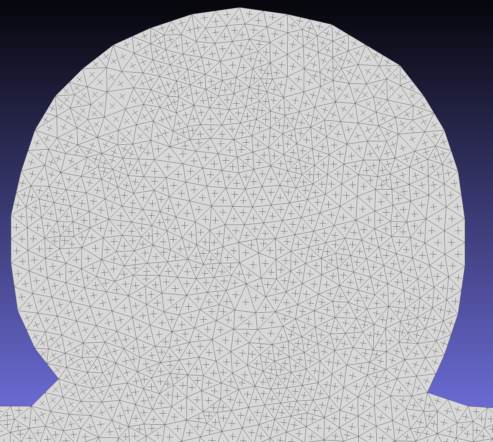
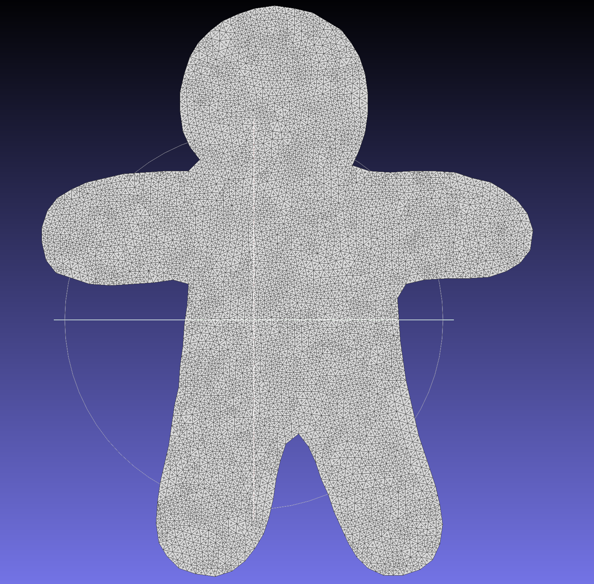

# 4-Rosy-Complex-Poly
We implement the paper **Designing N-PolyVector Fields with Complex Polynomials**.

Our implemention is based on C++, Openmesh and Eigen. The features are as follows:

1. Calculation of Frame Field
2. Detection of Singular vertex

We output the result and visualize them in meshlab.

